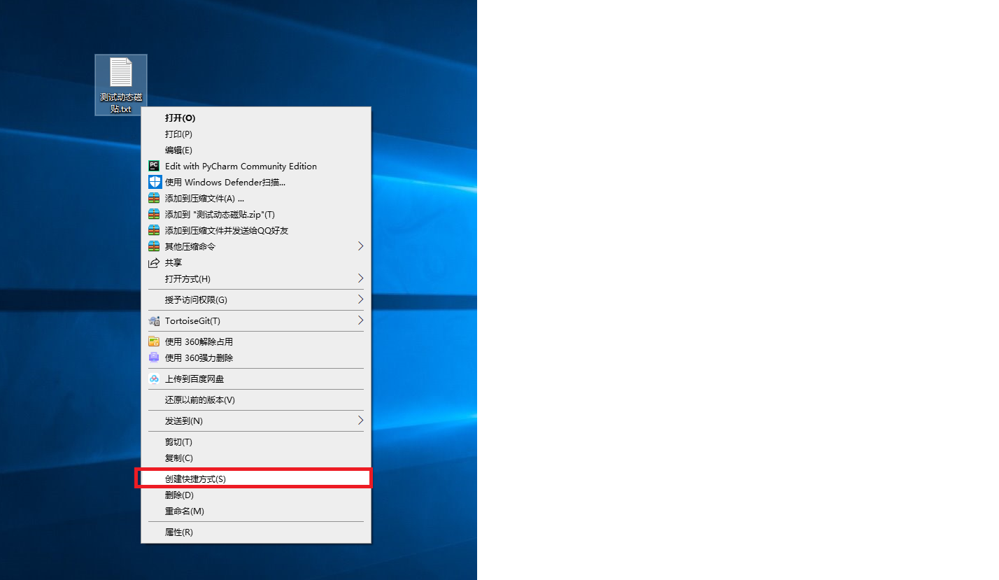
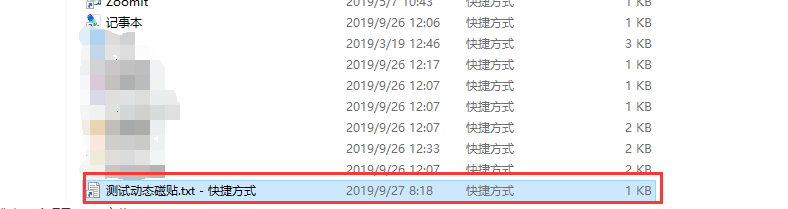
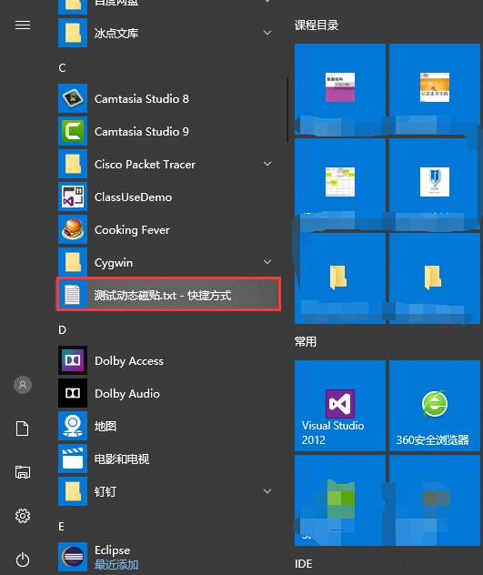
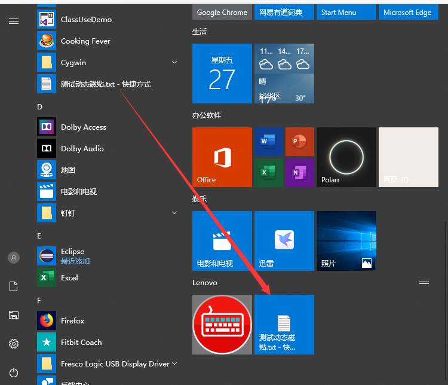

#  win10如何设置动态磁贴     
参考： https://blog.csdn.net/hxxjxw/article/details/93518297      
1. 创建快捷方式        
     

2. 将快捷方式复制到`C:\ProgramData\Microsoft\Windows\Start Menu\Programs`下    
     
3. 点击右键固定到开始屏幕 找到这个快捷方式     
          

4. 拖拽到磁贴位置     
          

