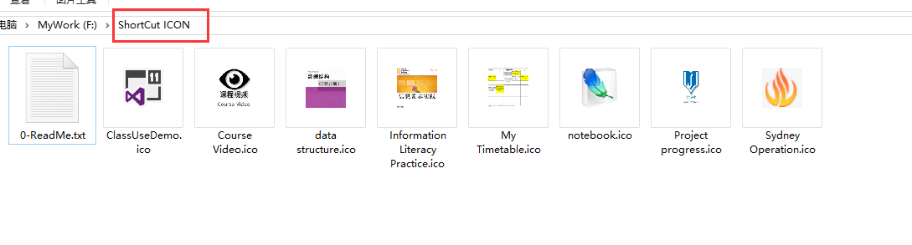
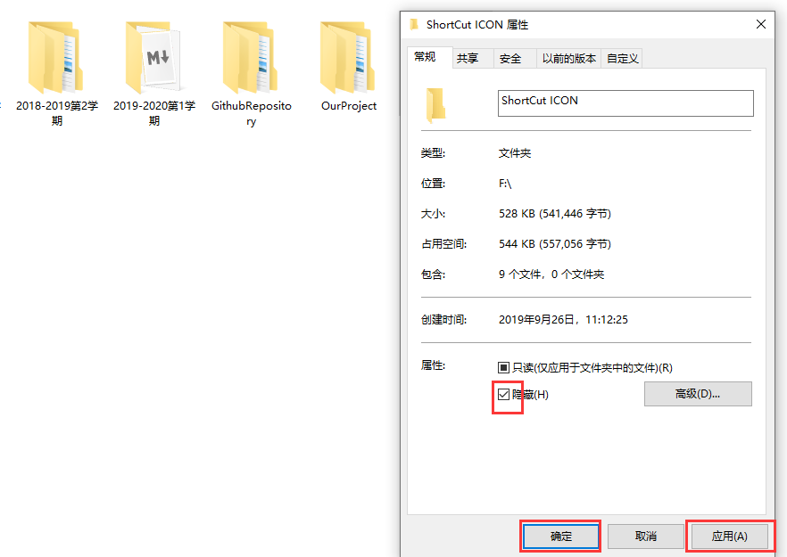

#  创建图标文件          
参考：https://zhidao.baidu.com/question/1994074668310888107.html    
制作方式：
1. 截取文件缩略图，在修改成ICON格式；  
2. 将文件现有图标显示成特大，然后截图，修改成ICON格式。    
3. 转化成ICON格式网址：  http://www.xwidea.cn/#downico        
4. 可以将设置的图标放在问价夹中      
     
5. 防止对图标文件误删可以将该文件夹隐藏掉   
      

[004 修改快捷方式图标.md](./004-修改快捷方式图标.md)      

