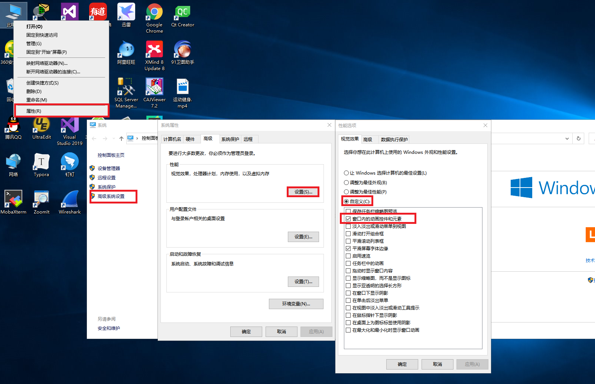
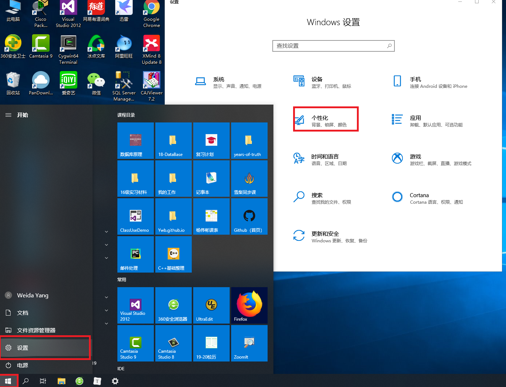
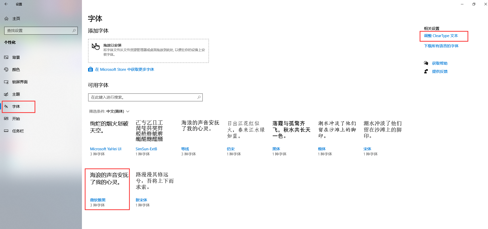
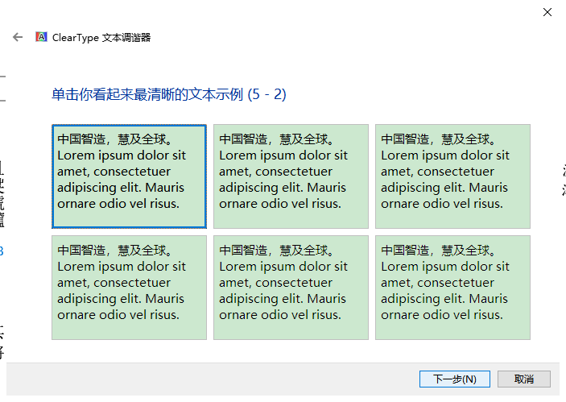

# 07 Win10切换桌面高效办公    
[TOC]
## 1 关闭桌面的切换效果   
1. 【桌面】，【我的电脑】，鼠标右键【属性】   
2. 【高级系统设置】，【高级】，【设置】  
3. 弹出的窗口，《性能选项》【视觉效果】，就是设置windows10 下的所有动画效果。
   
## 2 电脑字体可能变模糊，修改方法  
1. 打开个性化  
   
2. 打开字体，启用ClearType调整字体分辨率   
   
3. 按5次下一步，每次选择最佳字体   
   
4. 点击”完成“    
## 3 桌面切换快捷键  
1. 【Windows徽标键】+【Ctrl】+【D】可以新建一个桌面   
2. 同时按下【Windows徽标键】+【Ctrl】键加上【左右方向键】，就可以切换不用的桌面  
3. 删除桌面可以使用快捷键【Windows徽标键】+【Ctrl】+【F4】  
4. 按【Alt】+【Tab】组合键可以切换桌面，但默认是【仅限我正在使用的桌面】，进入【设置】-【系统】-【多任务】选项中可以将其修改为【所有桌面】，就可以在虚拟桌面间进行切换。   
## 4 参考链接  
1. [字体模糊处理](http://www.udaxia.com/wtjd/16596.html)    
2. [桌面切换效果开启和关闭](https://www.jianshu.com/p/8d5ade17dde9)   
3. [win10切换快捷键](https://zhidao.baidu.com/question/244323665160894484.html)   

