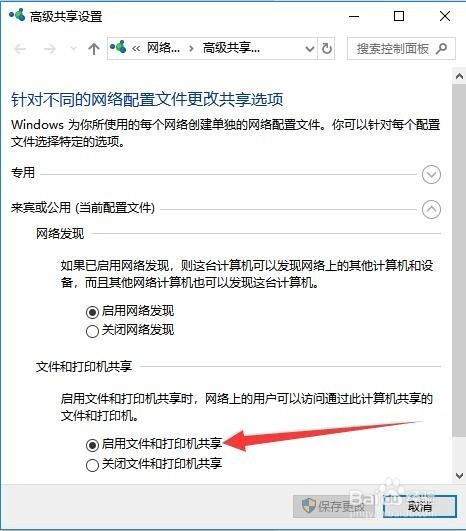
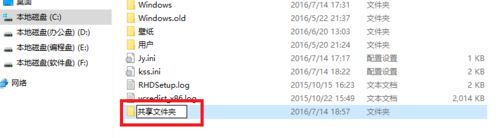
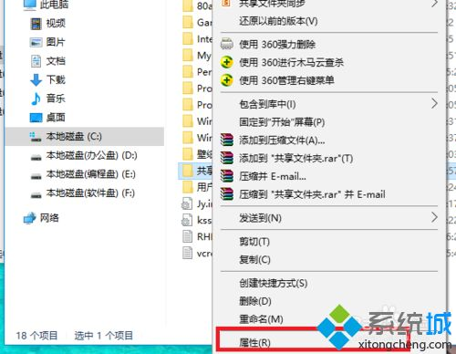
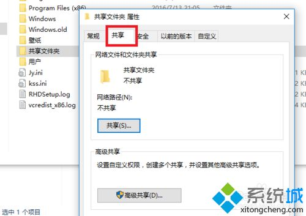
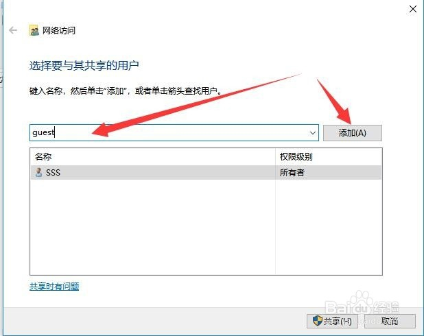
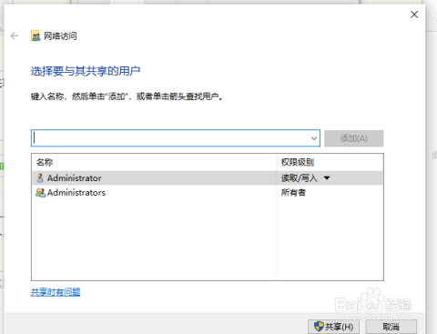
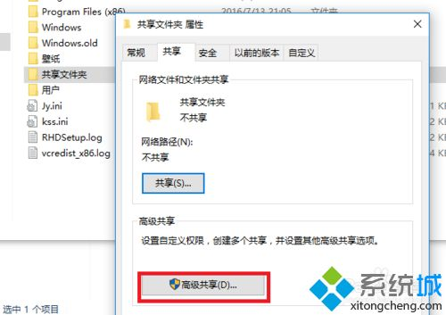
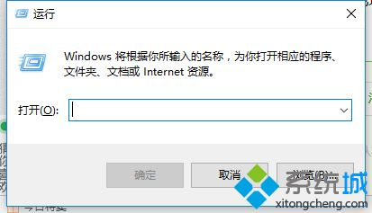
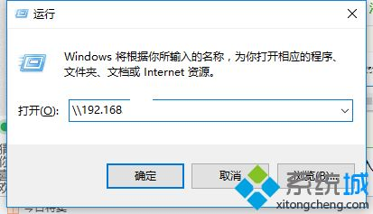

# 010-局域网内部共享文件目录   
## 1 工具/原料  
- win10  
- 局域网已连通（guest帐户已启用）  
## 2 初步设置  
1. 右键点击右下角的小电脑，选择【打开网络和共享中心】；  
  
2. 弹出的页面的列表中选择【更改高级共享设置】；   
  

3. 选中【启用文件和打印机共享】   
  

## 2 方法/步骤  
1. 先在C盘目录下新建一个文件夹，我命名为“共享文件夹”，然后将你需要共享的文件放在在这个文件夹的目录之下。  
  

2、右击共享文件夹，找到属性选项，点击“属性”。

    

3、进入到共享文件夹属性界面后，找到“共享”菜单项，单击选择**用户，及其权限**。    

   

    

4、在”共享“菜单界面中，点击“高级共享”按钮。

  

5、进入”高级共享“界面后，勾选第一行的“共享此文件夹”，共享名自理或者就采用默认的共享文件名，点击”确定“，完成文件夹的共享。

  

6、在局域网的另一台电脑，用”WIN键+R“打开运行。

  

7、输入共享文件夹电脑的IP地址，格式为"\\192.168.XXX.XXX"，点击”确定“。

  

8、接下里弹出一个界面，显示的是局域网内指定IP地址所共享的文件，打开”共享文件夹“将需要的文件复制在自己电脑就行。

  

win10在局域网内共享文件夹是一个比较简便的方法，节省时间，能够随时随地完成更多工作。

## 3 总结  
1. 共享文件夹时再选择用户时，需要有这个用户账号和密码   
2. `\\192.168.XXX.XXX`斜杠的方向不能反了   
3. 用这个方法也可以共享硬盘    

## 4 参考资料  

1. https://jingyan.baidu.com/article/5225f26b9d41e5e6fa0908f0.html   
2. https://jingyan.baidu.com/article/d7130635964e9213fcf47558.html  
3. https://jingyan.baidu.com/album/5225f26b9d41e5e6fa0908f0.html?picindex=2   

