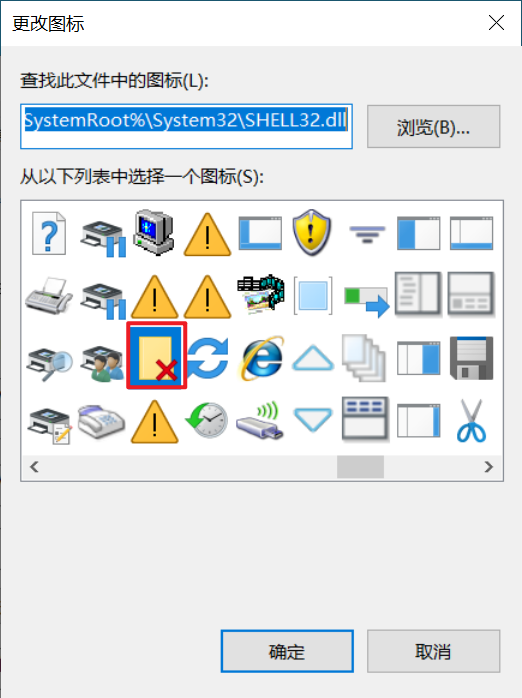

# [Win10 如何一键关闭所有文件夹](./)    [img](./img)  

## 1 新建快捷方式   

填入如下命令   

```
nircmd.exe cmdshortcut " "~$folder.desktop$ "关闭窗口" win close class "CabinetWClass"
```

## 2 安装nircmd.exe   

1. 下载79号文件：[79-nirsoft_package_enc_1.23.43.zip](E:\00-software-installation)    
2. 解压缩，将nircmd.exe，复制到C:\Windows中    
3. 给360添加信任   


## 3 nircmd.exe功能扩展     

- 支持各种命令    
- 对于批量操作非常有用  
- 启发以后可以用快捷方式和命令结合  


## 4 图标   

图标使用的是win10系统内部的图标，如下图所示：  
<center>
  
</center> 


## 5 参考资料   

1. https://jingyan.baidu.com/article/f79b7cb30a5b1d9144023ee4.html    
2. https://blog.csdn.net/hongkaihua1987/article/details/85050851      