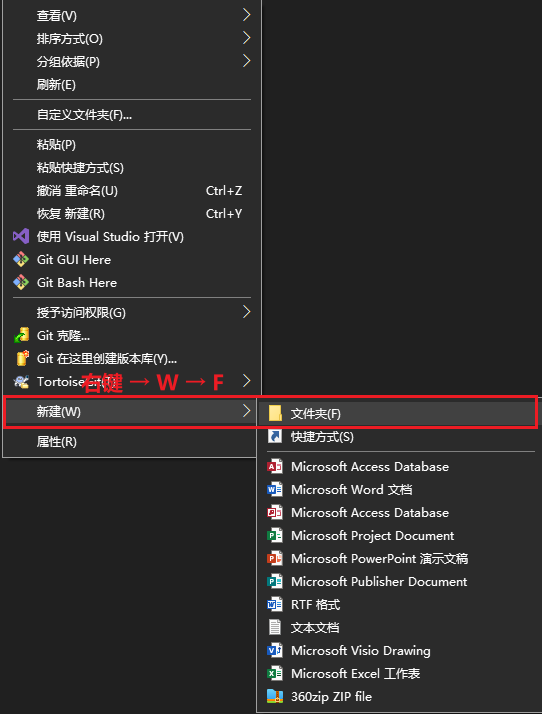

# win10常用的快捷键  

## 概述  
由于用键盘和鼠标的组合，对颈椎影响比较大，而使用小红点键盘的话，可以脱离对鼠标的依赖，使颈椎一直保持在直立的状态。由此，买了一个小红点键盘，尽量快捷的进行文件的各种操作，因此，总结一下常用的快捷键，把工作效率发挥到极致。 

## 常用快捷键  

>##### 新建文件夹  
>
>右键 → W → F 
>
>

>##### 打开资源管理器
>
>Win + E 

>##### 应用切换  
>
>win + 1 (2  3) 可以实现当前打开的不同应用的切换。   

>##### 快速回到桌面   
>
>win + D  

>##### 关闭窗口  
>
>Ctrl + S      然后    Alt + F4 

>##### 循环任务栏  
>
>win + T