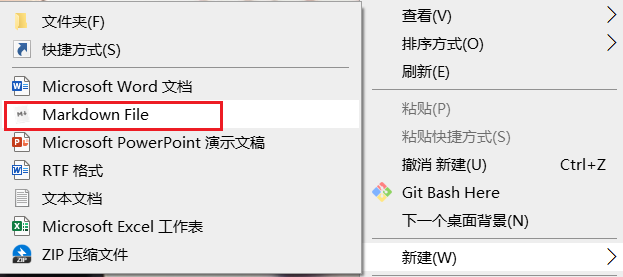

# 右击菜单中添加markdown  

## 概述  
新建文档中没有创建markdown文档的选项，这样每次都使用txt文件去修改后缀名的方式比较麻烦，如何修改这种现象，可以在右击菜单中添加新建markdown文档的选项。

## 操作方式   

新建一个注册表的txt文档，添加如下内容：  
```reg
Windows Registry Editor Version 5.00

[HKEY_CLASSES_ROOT\.md]
@="Typora.md"
"Content Type"="text/markdown"
"PerceivedType"="text"

[HKEY_CLASSES_ROOT\.md\ShellNew]
"NullFile"=""
```
UTF-8编码，保存为 .reg文件。双击导入    
## 导入注册表   
双击即可导入到注册表 ，测试如下：  

   

## 添加快捷键  
查找注册表中的`Markdown File`，修改为`Markdown File(&M)`对于查找的位置需要一个一个的尝试，我在修改了两次才查找成功     
   

修改后效果如下：   
  


## 参考资料  

1. https://blog.csdn.net/Palmer9/article/details/105776578   