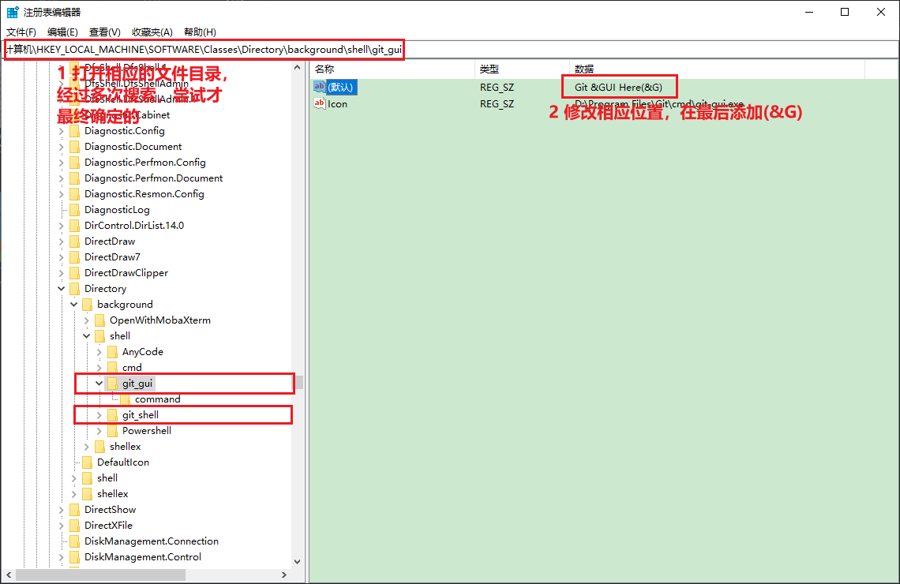
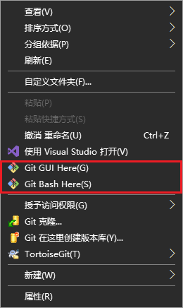

# 右击菜单中添加Git快捷键  

## 概述  
在右击菜单中，没有看到Git Bash和Git GUI的快捷键，使用起来比较麻烦。因此，添加相应的快捷按键。   

## 注册表  
### 1 查找  
一开始在注册表中，查找`Git Bash Here` ，并没有找到任何数据，后来在shell目录中，找到相应的git shell 才发现，Git Bash和Git Gui是有快捷键的，只是没有在右击菜单中看出来而已，看到的`Git Bash Here`实际上是`Git Ba&sh Here`，因此当时没有搜索到。  

开始搜索`Git Ba`，发现了几处，然后进行了相应的修改，第三次的时候才成功了。

### 2 修改如下   
   

### 3 最终效果   

     

## 参考资料  

1. https://blog.csdn.net/qq_40237389/article/details/103714883    